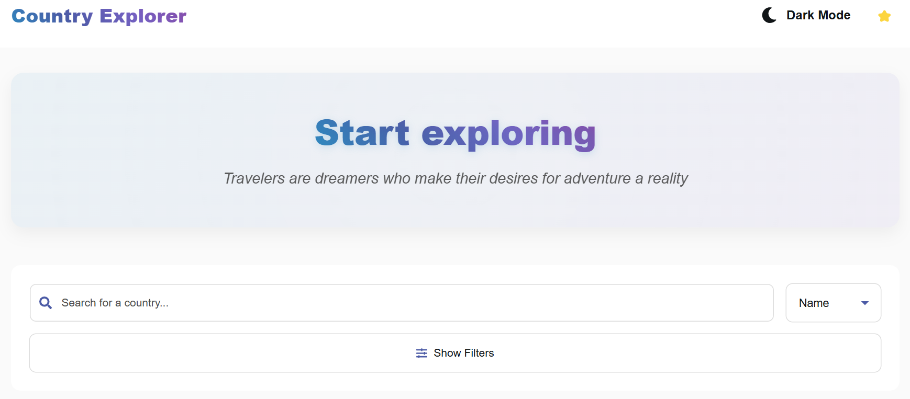

# 🌍 Country Explorer - Frontend Coding Challenge



This project is part of a **Frontend Web Developer coding challenge** provided by [Numbero](https://www.numbero.de/). The goal is to build a small React web app that interacts with a public API and demonstrates core frontend skills like state management, API integration, and user interface design.

---

## 🔧 How to access it

- To run it locally

```bash
# Install dependencies
npm install

# Start the development server
npm run dev
```

- On [Netlify](https://country-explorer-webapp.netlify.app/)

---

## 📁 Project Structure

```
country-explorer/
├── node_modules/
├── public/
│   ├── earth.svg
│   └── vite.svg
├── src/
│   ├── assets/
│   ├── components/
│   │   ├── CountryCard.css
│   │   ├── CountryCard.tsx
│   │   ├── FavoriteButton.css
│   │   ├── FavoriteButton.css
│   │   ├── FavoritesList.tsx
│   │   ├── Header.css
│   │   ├── Navbar.css
│   │   ├── Navbar.tsx
│   │   ├── SearchBar.css
│   │   ├── SearchBar.tsx
│   │   ├── Sidebar.css
│   │   └── Sidebar.tsx
│   ├── context/
│   │   └── FavoritesContext.tsx
│   ├── hooks/
│   │   └── useCountries.ts
│   ├── pages/
│   │   ├── Home.css
│   │   └── Home.tsx
│   ├── types/
│   │   └── Country.ts
│   ├── App.css
│   ├── App.tsx
│   ├── index.css
│   ├── main.tsx
│   └── vite-env.d.ts
├── package-lock.json
├── package.json
└── README.md
```

---

## 🚀 Project Overview

### **Country Explorer** is a simple web application that allows users to:

-**Search** for countries using different fields: name, region, capital, population, currencz and language

-**Display** results in a clean, user-friendly layout

-**Mark countries as favorites**

-**View favorites** in a separate section

➡️ To be implemented next:

- **Change** from light mode to dark mode
- **Mark** countries **visited**
- **Mark** countries to **visit next**
- **Delete** countries from lists

This app uses the [RESTCountries API](https://restcountries.com/) to fetch live country data.

### 🛠️ Technologies Used

- **React**
- **JavaScript** + **TypeScript**
- **CSS**
- **RESTCountries API**
- **Generative Artificial Intelligence** for specific purposes
- **Netlify** for deployment

---

## 🌐 Project Management

### 💡 First steps

1. Looked for [inspiration](https://countries.petethompson.net/)
2. Selected functionalities: must have and nice to have
3. Drafted a wireframe
4. Translated the design into code

### 🎯 Challenges faced and Lessons learned

As a frontend developer in training, this project helped me gain valuable experience in:

- Building a React web app for the first time, which involved learning component-based architecture, state management, and React-specific development workflows
- Integrating an API for the first time: Learned how to fetch, handle, and display data from a RESTful API, including error handling and asynchronous operations in React
- Working with Github Desktop, which involved writing more efficient commits, improving version control workflows
- Deploying a web app on Netlify for the first time, which involver understanding how to prepare a production-ready build and identifying issues that only appear in production builds
